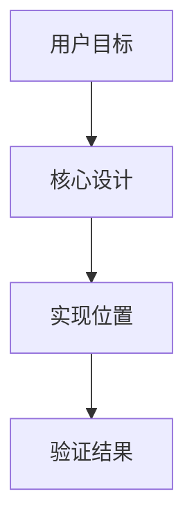

# {{title}}

## 这次解决了什么

用 2-4 句话说明用户原本要完成什么、最终完成了什么，以及这件事在项目里的价值。

## 大白话讲解

像老师给新手讲课一样解释核心思路。优先讲清楚“为什么这样设计”，不要只罗列步骤。

## 架构地图

说明关键模块、数据流、调用关系或状态变化。只有在图能帮助理解时才加入 Mermaid。

## 关键设计取舍

列出 2-5 个最重要的选择：为什么选它、它解决了什么问题、它带来了什么限制。

## 关键文件/接口

列出新手复习时最应该看的文件、函数、类、命令或接口。每一项都说明它承担的角色。

## 验证方法

说明运行了哪些检查、测试或手动验证。没有验证时，明确写出原因和剩余风险。

## 新手练习

给 2-4 个小练习，让使用者可以通过修改、观察、运行命令来真正掌握这次的设计。

